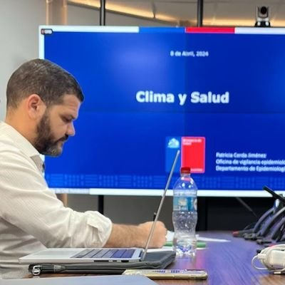

# Diego Ricardo Xavier Silva

**Pesquisador em Saúde Pública | Epidemiologista | Ciência de Dados**

Fundação Oswaldo Cruz (Fiocruz) · Instituto de Comunicação e Informação Científica e Tecnológica em Saúde (ICICT)

---

## Sobre mim

Sou pesquisador na **Fundação Oswaldo Cruz (Fiocruz)** desde 2009, atuando no **Laboratório de Informação em Saúde (LIS)** do ICICT. Minha trajetória acadêmica inclui doutorado em Saúde Pública pela Escola Nacional de Saúde Pública (ENSP/Fiocruz, 2021), mestrado em Epidemiologia (ENSP/Fiocruz, 2014) e graduação em Enfermagem pela Universidade do Estado de Mato Grosso (2009).

Coordeno o **Observatório de Clima e Saúde**, onde desenvolvemos métodos e ferramentas para monitorar os impactos das mudanças climáticas e desastres ambientais sobre a saúde da população brasileira. Meu trabalho busca fortalecer o SUS, especialmente em emergências de saúde pública.

Também leciono sobre **Geografia da Saúde** e atuo em análise de séries temporais de doenças transmissíveis, geoprocessamento, sistemas de informações geográficas e indicadores de saúde. Meu interesse central é a **ciência de dados aplicada à saúde**, com foco em mineração de dados e teoria dos grafos.

---

## Áreas de Pesquisa

| Área | Descrição |
|------|-----------|
| **Clima e Saúde** | Impactos das mudanças climáticas e desastres ambientais na saúde pública |
| **Ciência de Dados** | Mineração de dados, teoria dos grafos e aprendizado de máquina aplicados à saúde |
| **Epidemiologia Espacial** | Geoprocessamento, SIG e análise de difusão espaço-temporal de doenças |
| **Indicadores de Saúde** | Desenvolvimento e análise de indicadores para o SUS |
| **Arboviroses** | Dengue, Zika, Chikungunya — dinâmica espacial e fatores socioambientais |
| **Emergências em Saúde** | Vigilância e resposta a desastres, pandemias e crises sanitárias |

---

## Grupos de Pesquisa

- **Ciência de Dados Aplicada à Saúde** — Métodos computacionais para análise de grandes volumes de dados em saúde
- **Impactos Ambientais e Climáticos Globais sobre a Saúde** — Monitoramento e avaliação dos efeitos do clima na saúde
- **Informação em Saúde** — Sistemas de informação e indicadores para gestão do SUS

---

## Publicações Recentes

> Xavier, D.R. et al. **Climate change and health vulnerabilities: the case of 2024 floods in Rio Grande do Sul, Brazil.** *Trends in Health Sciences*, 2025.

> Xavier, D.R. et al. **Covid-19 Fiocruz Observatory — an analysis of the evolution of the pandemic from February 2020 to April 2022.** *Ciência & Saúde Coletiva*, 2023.

> Xavier, D.R. et al. **Involvement of political and socio-economic factors in the spatial and temporal dynamics of COVID-19 outcomes in Brazil.** *Arca Fiocruz*, 2022.

> Xavier, D.R. et al. **Difusão espaço-tempo do dengue no Município do Rio de Janeiro, Brasil, no período de 2000-2013.** *Cadernos de Saúde Pública*, 2017.

> Xavier, D.R. et al. **Toward an Early Warning System for Health Issues Related to Climate and Environmental Changes.** *Remote Sensing*, 2020.

Veja a lista completa no [Google Scholar](https://scholar.google.com/citations?user=PZWm2wYAAAAJ) ou no [Currículo Lattes](http://lattes.cnpq.br/7186076558136407).

---

## Formação Acadêmica

| Grau | Instituição | Ano |
|------|-------------|-----|
| **Doutorado** em Saúde Pública | ENSP/Fiocruz | 2021 |
| **Mestrado** em Epidemiologia | ENSP/Fiocruz | 2014 |
| **Graduação** em Enfermagem | UNEMAT | 2009 |

---

## Projetos e Iniciativas

- [**Observatório de Clima e Saúde**](https://climaesaude.icict.fiocruz.br/) — Plataforma de monitoramento dos impactos do clima na saúde
- [**Observatório Covid-19 Fiocruz**](https://portal.fiocruz.br/observatorio-covid-19) — Análises e boletins sobre a evolução da pandemia no Brasil

---

## Tecnologias e Ferramentas

---

📍 Rio de Janeiro, Brasil · 🏥 Fiocruz/ICICT · ♟️ Xadrez · 🐕 Dog lover

